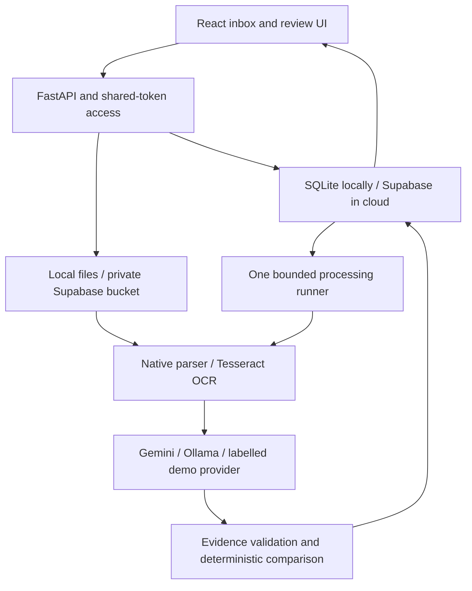

# QuayProof: implementation and reliability notes

## What runs where



The Docker image serves compiled React and FastAPI on one port. The runner shares that process and claims persisted case jobs atomically. Supabase uses `FOR UPDATE SKIP LOCKED`; SQLite uses a write transaction. One service and one runner are the supported deployment. Although database claims prevent simultaneous claims of the same job, broader multi-instance behavior and the maximum-case admission limit have not been load tested.

## Implemented workflow

1. Upload an email record and up to six allowed attachments; validate IDs, extensions and size limits.
2. Store attachment bytes and their SHA-256 identifiers; keep original bytes immutable.
3. Queue the case; a worker claims a 30-minute lease and increments the attempt count.
4. Classify the current email into the five required categories. Gemini/Ollama receive subject, body and attachment names as untrusted data. An unverified classification excerpt forces human classification review.
5. Only confident `BL_COMPARISON` cases proceed to document parsing and extraction. Non-BL cases still get categories and export entries.
6. Parse native text first. TXT retains line numbers; DOCX retains paragraph or table-row references; XLSX retains worksheet and contributing-cell references; PDF retains page and line coordinates. Image-only pages are rendered and sent to Tesseract locally.
7. Extract each document independently into a Pydantic schema. Require document-type source evidence. Identify exactly one SI and one BL; multiple/ambiguous pairings go to review.
8. Verify that every quote occurs in the selected source blocks, and every raw value appears in its quote. Reject unsupported candidates and flag conflicting readings.
9. Normalize text, units and counts with versioned code; compare all seven fields.
10. Persist the result, supporting observations, source blocks, provider fingerprint and run history. The UI shows confirmed differences and unknown values separately.
11. Record reviewer corrections or approval. A correction must have source support; an approval preserves the underlying status. A new document revision invalidates approval and queues a fresh comparison.
12. Export the public submission shape after completeness checks. Submission is a separate explicit action.

## Rules versus AI

| AI responsibility | Deterministic responsibility |
|---|---|
| Interpret current email intent and misleading subjects | Validate categories and gate document processing |
| Interpret semantic/bilingual labels and layout | Preserve sources and verify quotes/block references |
| Propose document type and raw field candidates | Require exactly one SI and one BL |
| Identify ambiguous readings | Normalize supported number/unit forms and compare values |
| Return structured extraction | Apply review policy, audit edits, prevent stale writes and export |

Gemini uses `generateContent` with `responseMimeType=application/json` and a JSON schema; Ollama uses local `/api/chat` with `format` set to that schema. Both results are validated again using Pydantic. AI is never asked to return the final mismatch list. [Gemini REST reference](https://ai.google.dev/api/generate-content), [Ollama structured outputs](https://docs.ollama.com/capabilities/structured-outputs)

The `demo` provider intentionally implements a small keyword/label baseline for reproducible plumbing tests. It is not a model, classifier benchmark, or competition-ready replacement for AI.

## Normalization and comparison policy

- Party fields preserve all words, numbers and address content. Case, Unicode width, whitespace and punctuation are standardized; legal suffixes and address numbers are not dropped. Punctuation folding can still conflate some identifiers, so evaluate it on authorized examples.
- Ports receive the same conservative text normalization. No geographic alias service or country/terminal inference is implemented. `Port Klang` versus a port code may require a reviewed alias rule.
- Container counts accept positive integers and one count × supported container-size expression. Package/carton counts and composite expressions are not guessed.
- Weight arithmetic uses Decimal. Supported units are kg, metric tonnes and pounds; plain `tons` is deliberately ambiguous. A numeric-only weight needs a kilogram unit in its selected source context. English thousands grouping is recognized; decimal-comma formats are escalated.
- No rounding tolerance is assumed. `12500` and `12500.0` match after Decimal normalization; different values remain differences.
- Missing values on both sides are unknown, never equal.
- AI-proposed uncertain candidates, invalid sources, low OCR quality or conflicting candidates are unusable until resolved.
- All numeric OCR fields require human confirmation, even with a high OCR score. OCR words retain boxes and a heuristic quality signal; these are not calibrated correctness probabilities.

Outcome policy:

| Evidence | Product result |
|---|---|
| All seven fields usable and equal | `OK`, complete, no required review |
| At least one difference and no unknowns | `MISMATCH`, complete |
| Unknown fields and no confirmed differences | `NEEDS_REVIEW`, `missing_value` |
| Confirmed difference plus unknown field(s) | `MISMATCH` + visible required review + incomplete |
| Too few attachments | `NEEDS_REVIEW`, `missing_attachment` |
| Wrong/ambiguous document pairing | `NEEDS_REVIEW`, `wrong_doc_type` |
| Damaged/unreadable/unsupported-size document | `NEEDS_REVIEW`, reason and detailed parser explanation |
| Infrastructure/API/tool failure | Processing `failed` or queued retry; no comparison verdict |

An unresolved email category is a classification-review task, not a guessed BL review reason. The UI exposes the proposed category with uncertainty and requires a human category decision before export.

Mixed defect/unknown cases are blocked from export until resolved because organizer precedence for that combination has not been validated. The app does not claim to reproduce hidden scoring behavior.

## Evidence record

An observation stores `field`, `raw_value`, `normalized_value`, unit, document ID, SHA-256 hash, revision number, block IDs, exact quote, source locations, method/provider version, quality signals, usability, confidence label and escalation reason. Source blocks also retain PDF/OCR coordinates.

The UI highlights text blocks and offers original-file downloads. It does not yet overlay boxes on a rendered PDF, and coordinates are not a substitute for checking the original image. Native PDF coordinates use top-origin PDF points; OCR coordinates are transformed back from the rendered bitmap by dividing by the raster scale. Rotated/cropped pages need additional validation before relying on graphical overlays.

Evidence grounding prevents a model from inventing values that do not appear in the supplied blocks. It does **not** prove that the model selected the correct field, complete address, document role or total rather than a subtotal. Human review and field-level evaluation remain necessary.

## Persistence model

For hackathon simplicity, one `qp_cases` JSONB payload holds the email, document metadata, source blocks, field observations, result, audit events, run history and job/checkpoint state. `version` is duplicated in the table for optimistic concurrency. This is deliberately simpler than a large normalized schema.

`qp_ai_usage` counts reserved model calls per UTC day. A database transaction reserves each call before the request. Counts include unsuccessful requests and both AI providers. Changing the application limit does not change provider quotas.

Supabase Storage retains document bytes in a private bucket. SQLite + a local document directory implements the same contract for development. Binary uploads preceding a failed case write can leave orphaned objects; an authenticated cleanup/admin tool is a future improvement, not implemented here. No destructive automatic cleanup is enabled.

## API map

All `/api` endpoints except health require `Authorization: Bearer <APP_ACCESS_TOKEN>` when the token is configured. Public mode requires a token of at least 24 characters. Browser requests use a token entered by the user and retained in session storage; provider keys never reach the browser.

| Method | Route | Purpose |
|---|---|---|
| GET | `/api/health` | Process health, no secrets |
| GET | `/api/config` | Provider/storage names and readiness flag |
| GET | `/api/cases` | Inbox summaries |
| GET | `/api/cases/{id}` | Case, documents, observations and audit |
| POST | `/api/cases` | Multipart email + attachments |
| POST | `/api/demo` | Idempotently insert/queue nine synthetic cases |
| POST | `/api/cases/{id}/run` | Queue/retry using expected version |
| POST | `/api/cases/{id}/review` | Correct field/category, confirm field or acknowledge report |
| POST | `/api/cases/{id}/documents` | Add a missing attachment and reprocess |
| POST | `/api/cases/{id}/documents/{doc}/revision` | Preserve old bytes, add new revision and reprocess |
| GET | `/api/cases/{id}/documents/{doc}` | Authorized original-file download |
| GET | `/api/export` | Full imported-case submission, demo excluded |

Example source-backed correction:

```json
{
  "version": 8,
  "action": "correct_field",
  "actor": "Operations reviewer",
  "reason": "Verified the total gross weight against the supplied source",
  "document_id": "document-id-from-case",
  "field": "gross_weight_kg",
  "block_ids": ["b8"],
  "raw_value": "12,500 kg"
}
```

A stale version returns HTTP 409. A source-free correction returns HTTP 400. Review names are self-entered and not authenticated identities; use Supabase Auth/role controls before claiming individual accountability.

## Failure and retry behavior

- One job at a time limits free-host CPU/RAM use. State is checkpointed after classification, parsing and extraction, then at completion.
- Each active stage renews a 30-minute lease. A terminated process leaves a recoverable lease; another active runner can reclaim it after expiry.
- Provider network failures, HTTP 429/5xx and malformed model JSON are retried up to three total attempts, with persisted 30/60-second waits. The worker keeps polling other eligible jobs; it does not block on a sleep for one case.
- Missing credentials, denied cloud consent, application daily cap and other permanent configuration errors fail visibly. The user explicitly retries after fixing them.
- Missing values and damaged documents are review outcomes, not an invitation to retry indefinitely.
- Manual retry resets the attempt budget but reuses valid checkpoints. A changed provider/model/prompt fingerprint invalidates cached extraction. The code's pipeline version must be bumped when changing extraction semantics.
- Service/db outages are logged by exception type without logging document text or API keys. A checkpoint failure may require lease recovery.

## Security and scope limits

Uploads are constrained to six active files, 10 MB each, ten PDF pages by default, 80,000 extracted characters and 20,000 Excel cells. Office archive expansion is bounded; Excel formulas are not executed. Files are served as downloads, and document text is rendered through React text escaping.

These controls are appropriate for a protected hackathon demo, not hostile multi-tenant production traffic. Full malware scanning, total streaming-body limits, per-user rate limiting, parser-process isolation/timeouts for every native format, SSO, deletion/retention policy and fine-grained audit identity are future work. A bearer-token holder can access the shared workspace. Do not place confidential production files in a publicly shared demo.

Existing Docker/parser packages also need routine vulnerability review and dependency updates before production. Keep raw participant files and organizer packages out of the public repository and container build context.
